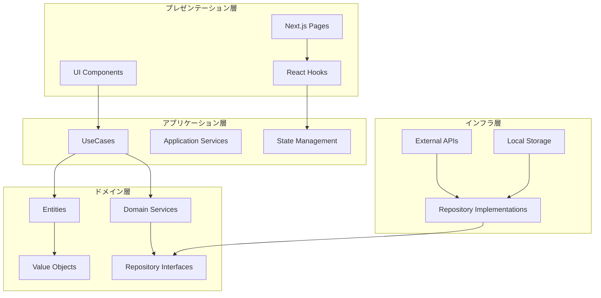

# Suno Maker アーキテクチャ設計書

## 🏗️ システム全体図



## 📁 ディレクトリ構造詳細

```
src/
├── domain/                           # ドメイン層
│   ├── entities/                     # エンティティ
│   │   ├── Prompt.ts                # プロンプトエンティティ
│   │   ├── Lyrics.ts                # 歌詞エンティティ
│   │   ├── Song.ts                  # 楽曲エンティティ
│   │   └── __tests__/               # エンティティテスト
│   ├── valueObjects/                # 値オブジェクト
│   │   ├── Genre.ts                 # ジャンル（120+種類）
│   │   ├── Language.ts              # 言語（17言語対応）
│   │   ├── StyleField.ts            # スタイルフィールド（120文字最適化）
│   │   └── __tests__/               # 値オブジェクトテスト
│   ├── repositories/                # リポジトリインターフェース
│   │   ├── IPromptRepository.ts     # プロンプトリポジトリ契約
│   │   ├── ILyricsRepository.ts     # 歌詞リポジトリ契約
│   │   └── ISongRepository.ts       # 楽曲リポジトリ契約
│   └── index.ts                     # ドメイン層エクスポート
├── application/                      # アプリケーション層
│   ├── usecases/                    # ユースケース
│   │   ├── GeneratePromptUseCase.ts # プロンプト生成ユースケース
│   │   ├── OptimizeLyricsUseCase.ts # 歌詞最適化ユースケース
│   │   ├── CreateSongUseCase.ts     # 楽曲作成ユースケース
│   │   └── __tests__/               # ユースケーステスト
│   ├── services/                    # アプリケーションサービス
│   │   ├── PromptOptimizationService.ts
│   │   ├── LyricsAnalysisService.ts
│   │   └── QualityScoreService.ts
│   └── stores/                      # 状態管理
│       ├── promptStore.ts           # プロンプト状態管理
│       ├── lyricsStore.ts           # 歌詞状態管理
│       └── appStore.ts              # アプリケーション全体状態
├── infrastructure/                   # インフラ層
│   ├── repositories/                # リポジトリ実装
│   │   ├── LocalPromptRepository.ts # ローカルストレージ実装
│   │   ├── LocalLyricsRepository.ts
│   │   └── LocalSongRepository.ts
│   ├── external/                    # 外部API
│   │   ├── SunoAPIClient.ts         # Suno API連携（将来実装）
│   │   └── OpenAIClient.ts          # OpenAI API連携（将来実装）
│   └── storage/                     # ストレージ
│       ├── LocalStorageAdapter.ts   # LocalStorage抽象化
│       └── IndexedDBAdapter.ts      # IndexedDB抽象化
└── presentation/                     # プレゼンテーション層
    ├── components/                   # UIコンポーネント
    │   ├── prompt/                  # プロンプト関連コンポーネント
    │   │   ├── PromptGenerator.tsx
    │   │   ├── GenreSelector.tsx
    │   │   ├── StyleFieldEditor.tsx
    │   │   └── OptimizationPanel.tsx
    │   ├── lyrics/                  # 歌詞関連コンポーネント
    │   │   ├── LyricsEditor.tsx
    │   │   ├── StructureTagEditor.tsx
    │   │   ├── LanguageOptimizer.tsx
    │   │   └── LyricsPreview.tsx
    │   ├── song/                    # 楽曲関連コンポーネント
    │   │   ├── SongBuilder.tsx
    │   │   ├── QualityScoreDisplay.tsx
    │   │   └── ExportDialog.tsx
    │   ├── shared/                  # 共通コンポーネント
    │   │   ├── Layout.tsx
    │   │   ├── Navigation.tsx
    │   │   ├── LoadingSpinner.tsx
    │   │   └── ErrorBoundary.tsx
    │   └── ui/                      # shadcn/ui コンポーネント
    │       ├── button.tsx
    │       ├── input.tsx
    │       ├── select.tsx
    │       └── ... (その他UIコンポーネント)
    ├── hooks/                       # React Hooks
    │   ├── usePromptGeneration.ts   # プロンプト生成ロジック
    │   ├── useLyricsOptimization.ts # 歌詞最適化ロジック
    │   ├── useLanguageDetection.ts  # 言語検出
    │   └── useLocalStorage.ts       # ローカルストレージ管理
    └── types/                       # 型定義
        ├── api.ts                   # API型定義
        ├── ui.ts                    # UI型定義
        └── common.ts                # 共通型定義
```

## 🎯 ドメイン層詳細設計

### エンティティ設計

#### 1. Prompt エンティティ
```typescript
class Prompt {
  private constructor(private readonly props: PromptProps) {}
  
  // ファクトリーメソッド
  static create(input: CreatePromptInput): Prompt
  
  // 不変更新メソッド
  updateTitle(title: string): Prompt
  updateGenre(genre: Genre): Prompt
  updateStyleField(styleField: StyleField): Prompt
  
  // ビジネスロジック
  generatePromptString(): PromptString
  generateOptimizedPrompt(): OptimizedPrompt
  calculateQualityScore(): QualityScore
  validate(): ValidationResult
  
  // 統計・分析
  getUsageStats(): UsageStats
  recordGeneration(successful: boolean, rating?: number): Prompt
}
```

#### 2. Lyrics エンティティ
```typescript
class Lyrics {
  // セクション構造分析
  extractSections(): LyricSection[]
  getStats(): LyricsStats
  
  // 最適化・変換
  formatForSuno(): string
  toPlainText(): string
  getOptimizationSuggestions(): string[]
  
  // バリデーション
  validate(): LyricsValidationResult
  
  // ユーティリティ
  getWordCount(): number
  getDuration(): number
}
```

#### 3. Song エンティティ
```typescript
class Song {
  // 楽曲分析
  getStats(): SongStats
  calculateQualityScore(): SongQualityScore
  getEstimatedDuration(): number
  
  // 状態管理
  markAsGenerated(sunoUrl?: string): Song
  updateRating(rating: number): Song
  incrementPlayCount(): Song
  
  // バリデーション
  validate(): SongValidationResult
  isReadyForGeneration(): boolean
  
  // ユーティリティ
  getRecommendedTags(): string[]
  clone(): Song
}
```

### 値オブジェクト設計

#### 1. Genre 値オブジェクト
```typescript
class Genre {
  // サポートジャンル管理
  static getSupportedGenres(): readonly SupportedGenre[]
  static getMainGenres(): readonly SupportedGenre[]
  static getSubGenres(mainGenre: SupportedGenre): readonly SupportedGenre[]
  
  // バリデーション
  static isSupported(genre: string): boolean
  static isValidCombination(genres: string[]): boolean
  
  // プロンプト生成
  toPromptString(options?: { priority?: 'low' | 'medium' | 'high' }): string
}
```

#### 2. Language 値オブジェクト
```typescript
class Language {
  // 言語情報
  getDisplayName(): string
  getQualityLevel(): QualityLevel
  getRecommendedScript(): ScriptType
  
  // 最適化
  getOptimizationSuggestions(): readonly string[]
  canMixWith(other: Language): boolean
  getOptimalMixRatio(other: Language): { primary: number; secondary: number }
  
  // 品質管理
  isHighQuality(): boolean
}
```

#### 3. StyleField 値オブジェクト
```typescript
class StyleField {
  // 構造分析
  extractGenres(): string[]
  extractInstruments(): string[]
  extractMoods(): string[]
  toStructured(): StructuredStyle
  
  // 最適化
  optimize(): string
  prioritize(priorities: Priority[]): string
  removeDuplicates(): StyleField
  
  // バリデーション
  isWithinLimit(): boolean
  getValidationIssues(): string[]
  getOptimizationSuggestions(): string[]
  
  // 統計
  getStats(): StyleStats
}
```

## 🔄 アプリケーション層設計

### ユースケース設計

#### 1. GeneratePromptUseCase
```typescript
interface GeneratePromptInput {
  genre: Genre
  language: Language
  mood?: string[]
  instruments?: string[]
  customStyle?: string
}

interface GeneratePromptOutput {
  prompt: Prompt
  optimizations: string[]
  qualityScore: number
  suggestions: string[]
}

class GeneratePromptUseCase {
  async execute(input: GeneratePromptInput): Promise<GeneratePromptOutput>
}
```

#### 2. OptimizeLyricsUseCase
```typescript
interface OptimizeLyricsInput {
  lyrics: Lyrics
  targetLanguage: Language
  optimizationType: 'suno' | 'general' | 'pronunciation'
}

interface OptimizeLyricsOutput {
  optimizedLyrics: Lyrics
  changes: OptimizationChange[]
  improvementScore: number
  warnings: string[]
}

class OptimizeLyricsUseCase {
  async execute(input: OptimizeLyricsInput): Promise<OptimizeLyricsOutput>
}
```

#### 3. CreateSongUseCase
```typescript
interface CreateSongInput {
  title: string
  prompt: Prompt
  lyrics?: Lyrics
  tags?: string[]
}

interface CreateSongOutput {
  song: Song
  readiness: ReadinessCheck
  nextSteps: string[]
}

class CreateSongUseCase {
  async execute(input: CreateSongInput): Promise<CreateSongOutput>
}
```

### 状態管理設計（Zustand）

#### アプリケーション状態
```typescript
interface AppStore {
  // 現在の作業状態
  currentPrompt: Prompt | null
  currentLyrics: Lyrics | null
  currentSong: Song | null
  
  // UI状態
  activeTab: 'prompt' | 'lyrics' | 'song'
  language: Language
  theme: 'light' | 'dark' | 'system'
  
  // 履歴管理
  promptHistory: Prompt[]
  lyricsHistory: Lyrics[]
  
  // アクション
  setPrompt: (prompt: Prompt) => void
  setLyrics: (lyrics: Lyrics) => void
  setSong: (song: Song) => void
  
  // 非同期アクション
  generatePrompt: (input: GeneratePromptInput) => Promise<void>
  optimizeLyrics: (input: OptimizeLyricsInput) => Promise<void>
  createSong: (input: CreateSongInput) => Promise<void>
}
```

## 🗄️ インフラ層設計

### リポジトリ実装

#### LocalStorage実装例
```typescript
class LocalPromptRepository implements IPromptRepository {
  private readonly storage: LocalStorageAdapter
  private readonly cache: Map<string, Prompt> = new Map()
  
  async save(prompt: Prompt): Promise<void> {
    this.cache.set(prompt.id, prompt)
    await this.storage.setItem(`prompt:${prompt.id}`, prompt.toJSON())
  }
  
  async findById(id: string): Promise<Prompt | null> {
    if (this.cache.has(id)) {
      return this.cache.get(id)!
    }
    
    const data = await this.storage.getItem(`prompt:${id}`)
    if (!data) return null
    
    const prompt = Prompt.fromJSON(data)
    this.cache.set(id, prompt)
    return prompt
  }
  
  async findByFilters(
    filters: PromptSearchFilters,
    options?: PromptSearchOptions
  ): Promise<PromptSearchResult> {
    // フィルタリング・ソート・ページング実装
  }
}
```

### ストレージ抽象化

#### LocalStorageAdapter
```typescript
class LocalStorageAdapter {
  async setItem<T>(key: string, value: T): Promise<void> {
    try {
      localStorage.setItem(key, JSON.stringify(value))
    } catch (error) {
      throw new StorageError(`Failed to save ${key}: ${error.message}`)
    }
  }
  
  async getItem<T>(key: string): Promise<T | null> {
    try {
      const item = localStorage.getItem(key)
      return item ? JSON.parse(item) : null
    } catch (error) {
      throw new StorageError(`Failed to load ${key}: ${error.message}`)
    }
  }
}
```

## 🖼️ プレゼンテーション層設計

### コンポーネント階層

#### 1. PromptGenerator コンポーネント
```typescript
interface PromptGeneratorProps {
  onPromptGenerated: (prompt: Prompt) => void
  initialGenre?: Genre
  initialLanguage?: Language
}

const PromptGenerator: React.FC<PromptGeneratorProps> = ({
  onPromptGenerated,
  initialGenre,
  initialLanguage
}) => {
  const [genre, setGenre] = useState(initialGenre)
  const [language, setLanguage] = useState(initialLanguage)
  const [styleField, setStyleField] = useState<StyleField | null>(null)
  
  const { generatePrompt, isLoading, error } = usePromptGeneration()
  
  return (
    <div className="prompt-generator">
      <GenreSelector 
        selectedGenres={genre ? [genre] : []}
        onGenreChange={setGenre}
      />
      <LanguageSelector
        selectedLanguage={language}
        onLanguageChange={setLanguage}
      />
      <StyleFieldEditor
        styleField={styleField}
        onStyleFieldChange={setStyleField}
      />
      <OptimizationPanel
        genre={genre}
        language={language}
        styleField={styleField}
      />
    </div>
  )
}
```

#### 2. LyricsEditor コンポーネント
```typescript
interface LyricsEditorProps {
  lyrics?: Lyrics
  language: Language
  onLyricsChange: (lyrics: Lyrics) => void
  optimizationMode: 'suno' | 'general'
}

const LyricsEditor: React.FC<LyricsEditorProps> = ({
  lyrics,
  language,
  onLyricsChange,
  optimizationMode
}) => {
  const [content, setContent] = useState(lyrics?.content || '')
  const { optimizeLyrics, suggestions } = useLyricsOptimization()
  
  return (
    <div className="lyrics-editor">
      <StructureTagEditor
        content={content}
        onContentChange={setContent}
      />
      <LanguageOptimizer
        language={language}
        content={content}
        suggestions={suggestions}
      />
      <LyricsPreview
        lyrics={lyrics}
        format={optimizationMode}
      />
    </div>
  )
}
```

### Custom Hooks設計

#### usePromptGeneration
```typescript
interface UsePromptGenerationReturn {
  generatePrompt: (input: GeneratePromptInput) => Promise<void>
  optimizePrompt: (prompt: Prompt) => Promise<OptimizedPrompt>
  isLoading: boolean
  error: string | null
  lastGenerated: Prompt | null
}

const usePromptGeneration = (): UsePromptGenerationReturn => {
  const [isLoading, setIsLoading] = useState(false)
  const [error, setError] = useState<string | null>(null)
  const [lastGenerated, setLastGenerated] = useState<Prompt | null>(null)
  
  const generatePrompt = useCallback(async (input: GeneratePromptInput) => {
    setIsLoading(true)
    setError(null)
    
    try {
      const useCase = new GeneratePromptUseCase(/* dependencies */)
      const result = await useCase.execute(input)
      setLastGenerated(result.prompt)
    } catch (err) {
      setError(err.message)
    } finally {
      setIsLoading(false)
    }
  }, [])
  
  return { generatePrompt, isLoading, error, lastGenerated }
}
```

## 🔧 依存性注入設計

### DIコンテナ
```typescript
interface Dependencies {
  promptRepository: IPromptRepository
  lyricsRepository: ILyricsRepository
  songRepository: ISongRepository
  
  promptOptimizationService: PromptOptimizationService
  lyricsAnalysisService: LyricsAnalysisService
  qualityScoreService: QualityScoreService
}

class DIContainer {
  private static instance: DIContainer
  private dependencies: Dependencies
  
  static getInstance(): DIContainer {
    if (!this.instance) {
      this.instance = new DIContainer()
    }
    return this.instance
  }
  
  getDependencies(): Dependencies {
    if (!this.dependencies) {
      this.dependencies = this.createDependencies()
    }
    return this.dependencies
  }
  
  private createDependencies(): Dependencies {
    const storage = new LocalStorageAdapter()
    
    return {
      promptRepository: new LocalPromptRepository(storage),
      lyricsRepository: new LocalLyricsRepository(storage),
      songRepository: new LocalSongRepository(storage),
      
      promptOptimizationService: new PromptOptimizationService(),
      lyricsAnalysisService: new LyricsAnalysisService(),
      qualityScoreService: new QualityScoreService()
    }
  }
}
```

## 🧪 テストアーキテクチャ

### テスト構造
```typescript
// 1. 単体テスト（ドメイン層）
describe('Genre Value Object', () => {
  it('should create valid genre', () => {
    const genre = Genre.create('Rock')
    expect(genre.value).toBe('Rock')
  })
  
  it('should validate complex genre combinations', () => {
    expect(Genre.isValidCombination(['Rock', 'Pop'])).toBe(true)
    expect(Genre.isValidCombination(['Rock', 'Rock'])).toBe(false)
  })
})

// 2. 統合テスト（ユースケース）
describe('GeneratePromptUseCase', () => {
  let useCase: GeneratePromptUseCase
  let mockRepository: jest.Mocked<IPromptRepository>
  
  beforeEach(() => {
    mockRepository = createMockRepository()
    useCase = new GeneratePromptUseCase(mockRepository)
  })
  
  it('should generate optimized prompt', async () => {
    const input = {
      genre: Genre.create('Rock'),
      language: Language.create('en')
    }
    
    const result = await useCase.execute(input)
    
    expect(result.prompt).toBeInstanceOf(Prompt)
    expect(result.qualityScore).toBeGreaterThan(70)
  })
})

// 3. E2Eテスト（UI統合）
describe('Prompt Generation Flow', () => {
  it('should generate prompt from UI input', async () => {
    await page.goto('/prompt-generator')
    
    await page.selectOption('[data-testid=genre-selector]', 'Rock')
    await page.selectOption('[data-testid=language-selector]', 'en')
    await page.click('[data-testid=generate-button]')
    
    await expect(page.locator('[data-testid=generated-prompt]')).toBeVisible()
    
    const promptText = await page.textContent('[data-testid=generated-prompt]')
    expect(promptText).toContain('Rock')
  })
})
```

## 🚀 パフォーマンス最適化

### バンドル最適化
```typescript
// next.config.ts
const nextConfig = {
  experimental: {
    optimizePackageImports: ['recharts', 'framer-motion']
  },
  
  webpack: (config) => {
    config.optimization.splitChunks = {
      chunks: 'all',
      cacheGroups: {
        domain: {
          name: 'domain',
          test: /[\\/]src[\\/]domain[\\/]/,
          priority: 30
        },
        vendor: {
          name: 'vendor',
          test: /[\\/]node_modules[\\/]/,
          priority: 20
        }
      }
    }
    return config
  }
}
```

### メモリ最適化
```typescript
// React.memo for expensive components
const ExpensiveComponent = React.memo(({ data }) => {
  const memoizedValue = useMemo(() => {
    return expensiveCalculation(data)
  }, [data])
  
  return <div>{memoizedValue}</div>
})

// Virtualization for large lists
const VirtualizedGenreList = ({ genres }) => {
  return (
    <FixedSizeList
      height={400}
      itemCount={genres.length}
      itemSize={50}
    >
      {({ index, style }) => (
        <div style={style}>
          {genres[index]}
        </div>
      )}
    </FixedSizeList>
  )
}
```

## 📊 監視・分析

### エラー追跡
```typescript
// Sentry設定
import * as Sentry from "@sentry/nextjs"

Sentry.init({
  dsn: process.env.SENTRY_DSN,
  tracesSampleRate: 1.0,
  beforeSend(event, hint) {
    // 機密情報のフィルタリング
    return filterSensitiveData(event)
  }
})

// カスタムエラー追跡
class PromptGenerationError extends Error {
  constructor(
    message: string,
    public readonly input: GeneratePromptInput,
    public readonly context: Record<string, any>
  ) {
    super(message)
    this.name = 'PromptGenerationError'
  }
}
```

### パフォーマンス監視
```typescript
// Web Vitals追跡
import { getCLS, getFID, getLCP } from 'web-vitals'

function sendToAnalytics(metric) {
  const body = JSON.stringify(metric)
  
  if (navigator.sendBeacon) {
    navigator.sendBeacon('/analytics', body)
  } else {
    fetch('/analytics', { body, method: 'POST', keepalive: true })
  }
}

getCLS(sendToAnalytics)
getFID(sendToAnalytics)
getLCP(sendToAnalytics)
```

---

このアーキテクチャ設計により、スケーラブルで保守性の高いSuno Makerアプリケーションの実現を目指します。