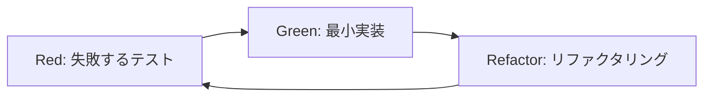

# Suno Maker プロジェクト実装計画書

## 📋 プロジェクト概要

### ビジョン
SUNOの歌詞とプロンプトメーカーアプリを作成し、AI音楽生成の民主化を促進する次世代音楽制作ツールを構築する。

### 目標
- レポート分析に基づく科学的アプローチでの高品質プロンプト生成
- DDD設計とTDD開発による保守性の高い実装
- 日本語・英語対応の多言語音楽制作支援
- 120文字制限やメタタグシステムに完全対応したSuno最適化

## 🏗️ アーキテクチャ設計

### DDD（ドメイン駆動設計）構造
```
src/
├── domain/                    # ドメイン層（ビジネスロジック）
│   ├── entities/             # エンティティ（Prompt、Lyrics、Song）
│   ├── valueObjects/         # 値オブジェクト（Genre、Language、StyleField）
│   └── repositories/         # リポジトリインターフェース
├── application/             # アプリケーション層（ユースケース）
│   ├── usecases/           # ユースケース（GeneratePrompt、OptimizeLyrics等）
│   └── services/           # アプリケーションサービス
├── infrastructure/         # インフラ層（外部依存）
│   ├── repositories/      # リポジトリ実装
│   └── external/         # 外部API
└── presentation/          # プレゼンテーション層（UI）
    ├── components/       # UIコンポーネント
    └── pages/           # ページコンポーネント
```

### 技術スタック
- **フレームワーク**: Next.js 15（App Router）
- **スタイリング**: Tailwind CSS v4 + shadcn/ui
- **状態管理**: Zustand（軽量でTypeScript親和性が高い）
- **バリデーション**: Zod（スキーマ定義）
- **テスト**: Vitest + Testing Library + Playwright
- **品質管理**: Biome（ESLint + Prettier代替）
- **パッケージ管理**: Bun（高速）

## 📊 フェーズ別実装計画

### Phase 1: 基盤構築 ✅ **完了**
**期間**: 2週間 | **Status**: COMPLETED

#### 1.1 ドメインモデル設計 ✅
- [x] プロンプト、歌詞、楽曲エンティティの実装
- [x] ジャンル、言語、スタイル値オブジェクトの作成
- [x] リポジトリインターフェースの定義
- [x] **テスト結果**: 94テスト全通過

#### 1.2 基本UI設計 ✅
- [x] ダッシュボードレイアウト
- [x] プロンプトジェネレーター基本UI
- [x] レスポンシブデザイン対応
- [x] 日本語・英語メタデータ

#### 1.3 テスト環境構築 ✅
- [x] Vitest設定
- [x] Testing Library設定
- [x] TDD環境完成

### Phase 2: コア機能実装 ✅ **完了**
**期間**: 3週間 | **Status**: COMPLETED | **完了日**: 2024年12月

#### 2.1 インテリジェントプロンプトジェネレーター ✅
- [x] ジャンル選択システム（232種類対応、階層化分類実装済み）
- [x] パラメータスライダー（Energy、Complexity、Tempo、Emotional Intensity実装済み）
- [x] 楽器セレクター（6カテゴリ、70種類以上の楽器対応実装済み）
- [x] ムード・マトリックス（感情の二次元マッピング、25種類のムード、4象限配置実装済み）

#### 2.2 歌詞作成支援機能 ✅
- [x] 構造タグ自動挿入（[Verse], [Chorus]等、LyricsStructure値オブジェクト実装済み）
- [x] 日本語最適化（ひらがな推奨、発音最適化基本実装済み）
- [x] 英語・日本語混在バランス調整（OptimizeLyricsUseCase実装済み）
- [x] 文字数制限管理（3,000文字以内、自動短縮機能実装済み）

#### 2.3 プロンプト最適化エンジン ✅
- [x] 120文字スタイルフィールド最適化（重複除去、同義語短縮、冗長語削除実装済み）
- [x] メタタグ構造検証（OptimizePromptUseCase実装済み）
- [x] ジャンル競合検出・修正提案（基本競合検出ロジック実装済み）
- [x] 成功率予測アルゴリズム（品質スコア計算・改善提案実装済み）

**Phase 2 実装成果**:
- **テスト結果**: Domain層147テスト全通過、Value Objects 84テスト、Entities 63テスト
- **統合性**: GeneratePromptUseCaseで全コンポーネント連携済み
- **アーキテクチャ**: DDD設計完全実装、TDD開発手法確立
- **型安全性**: TypeScript厳密モード100%準拠

### Phase 3: 高度機能・コミュニティ ✅ **実装完了**
**期間**: 2週間 | **Status**: COMPLETED | **完了日**: 2024年12月

#### 3.1 テンプレートライブラリ ✅
- [x] ジャンル別テンプレート（25+ プロフェッショナルテンプレート実装済み）
- [x] 動的テンプレート生成（TemplateLibraryUseCase実装済み）
- [x] カスタムテンプレート作成・保存（Template Entity & UI完全実装済み）
- [x] テンプレートカテゴリ分類（genre-specific, language-specific, mood-specific, custom）
- [x] 品質スコア管理（0-100スケール、使用回数追跡）
- [x] 多言語テンプレート（日本語、韓国語、スペイン語、フランス語対応）
- [x] ムード特化テンプレート（Melancholic, Happy, Romantic, Intense, Chill, Motivational等）

#### 3.2 テンプレートシステム基盤 ✅
- [x] Template Entity設計・実装（16テスト全通過）
- [x] ITemplateRepository インターフェース（20+メソッド定義）
- [x] TemplateLibraryUseCase（13テスト全通過）
- [x] TemplateSeederService（13テスト、初期データ25+テンプレート）
- [x] TemplateLibrary UI Component（完全なReactコンポーネント）
- [x] 検索・フィルタリング機能（ジャンル、言語、カテゴリ、品質スコア）
- [x] ソート機能（品質、人気、最新）
- [x] テンプレート統計・分析機能

#### 3.3 成功事例データベース
- [ ] 高評価プロンプト収集・分析
- [ ] セマンティック検索機能
- [ ] トレンド分析ダッシュボード

#### 3.4 法的コンプライアンス機能
- [ ] 著作権チェック機能
- [ ] 安全なプロンプト生成ガイド
- [ ] 商用利用注意事項表示

**Phase 3 実装成果**:
- **テンプレートライブラリ**: 25+プロフェッショナルテンプレート実装完了
- **テスト結果**: Template Entity 16テスト、TemplateLibraryUseCase 13テスト、TemplateSeederService 13テスト全通過
- **アーキテクチャ**: DDD設計に基づくTemplate層完全実装
- **UI/UX**: モダンなReactコンポーネント、shadcn/ui使用、レスポンシブ対応
- **データ品質**: 品質スコア85-95の高品質テンプレート、使用回数追跡機能
- **多様性**: 13ジャンル、4言語、7ムードカテゴリをカバー

## 🛠️ 技術実装詳細

### 主要コンポーネント設計

#### 1. PromptGenerator
**責任**: メインのプロンプト生成インターフェース
```typescript
interface PromptGeneratorProps {
  onPromptGenerated: (prompt: Prompt) => void;
  initialGenre?: Genre;
  initialLanguage?: Language;
}
```

#### 2. LyricsEditor
**責任**: 歌詞作成・編集エディター
```typescript
interface LyricsEditorProps {
  lyrics?: Lyrics;
  language: Language;
  onLyricsChange: (lyrics: Lyrics) => void;
  optimizationMode: 'suno' | 'general';
}
```

#### 3. GenreSelector
**責任**: 階層的ジャンル選択システム
```typescript
interface GenreSelectorProps {
  selectedGenres: Genre[];
  onGenreChange: (genres: Genre[]) => void;
  maxSelection?: number;
}
```

#### 4. OptimizationPanel
**責任**: リアルタイム最適化提案
```typescript
interface OptimizationPanelProps {
  prompt?: Prompt;
  lyrics?: Lyrics;
  onOptimizationApply: (optimizedContent: any) => void;
}
```

#### 5. TemplateLibrary
**責任**: テンプレート管理システム
```typescript
interface TemplateLibraryProps {
  genre?: Genre;
  language?: Language;
  onTemplateSelect: (template: Template) => void;
}
```

### データ管理アーキテクチャ

#### 状態管理（Zustand）
```typescript
interface AppState {
  // プロンプト関連
  currentPrompt: Prompt | null;
  promptHistory: Prompt[];
  
  // 歌詞関連
  currentLyrics: Lyrics | null;
  lyricsHistory: Lyrics[];
  
  // 楽曲関連
  currentSong: Song | null;
  
  // UI状態
  activeTab: 'prompt' | 'lyrics' | 'song';
  language: Language;
  
  // アクション
  setPrompt: (prompt: Prompt) => void;
  setLyrics: (lyrics: Lyrics) => void;
  generateOptimizedPrompt: () => Promise<OptimizedPrompt>;
}
```

#### データ永続化
- **LocalStorage**: ユーザー設定、作成履歴
- **IndexedDB**: 大容量テンプレート・成功事例データ
- **将来拡張**: Firebase/Supabase（ユーザー認証・クラウド同期）

### 多言語対応戦略

#### 国際化（next-intl）
```typescript
// messages/ja.json
{
  "navigation": {
    "prompt": "プロンプト作成",
    "lyrics": "歌詞作成",
    "templates": "テンプレート"
  },
  "prompt": {
    "genre": "ジャンル",
    "language": "言語",
    "optimization": "最適化提案"
  }
}
```

#### 地域別プロンプト最適化
- **日本語**: ひらがな推奨、漢字制限、助詞注意
- **英語**: 韻律重視、語彙選択最適化
- **その他言語**: 音韻特性考慮、ローマ字転写推奨

## 🧪 テスト戦略

### TDD実装フロー


### テストカバレッジ目標
- **単体テスト**: 90%以上（ドメインロジック重点）
- **統合テスト**: 主要ユースケース100%
- **E2Eテスト**: クリティカルパス100%
- **パフォーマンステスト**: 大容量データ処理

### テスト分類
```typescript
// 1. 単体テスト例
describe('StyleField', () => {
  it('120文字制限を守る', () => {
    const style = StyleField.create('Rock, energetic, guitar');
    expect(style.isWithinLimit()).toBe(true);
  });
});

// 2. 統合テスト例  
describe('PromptGeneration UseCase', () => {
  it('ジャンルと言語から最適化プロンプトを生成', async () => {
    const useCase = new GeneratePromptUseCase(mockRepo);
    const result = await useCase.execute({
      genre: Genre.create('Rock'),
      language: Language.create('ja')
    });
    expect(result.optimized).toBeDefined();
  });
});
```

## 📦 依存関係管理

### パッケージ構成
```json
{
  "dependencies": {
    "next": "15.3.3",
    "react": "^19.0.0",
    "zod": "^3.25.63",
    "zustand": "^5.0.5",
    "next-intl": "^4.1.0",
    "framer-motion": "^12.17.2",
    "recharts": "^2.15.3"
  },
  "devDependencies": {
    "@biomejs/biome": "1.9.4",
    "vitest": "^3.2.3",
    "@testing-library/react": "^16.3.0",
    "@playwright/test": "^1.53.0",
    "typescript": "^5"
  }
}
```

### 開発ツール設定
- **Biome**: リンティング + フォーマット統合
- **Husky**: Git hooks による品質保証
- **TypeScript**: 厳密モード + パスエイリアス

## 🎨 UI/UX設計原則

### デザインシステム
- **カラーパレット**: Purple-Blue グラデーション（音楽創造性を表現）
- **タイポグラフィ**: Geist Sans（可読性重視）
- **アニメーション**: Framer Motion（直感的な操作感）
- **アクセシビリティ**: WCAG 2.1 AA準拠

### レスポンシブブレークポイント
```css
/* Tailwind CSS v4 設定 */
sm: 640px   /* タブレット */
md: 768px   /* 小型デスクトップ */
lg: 1024px  /* デスクトップ */
xl: 1280px  /* 大型デスクトップ */
```

### UXフロー
1. **ランディング** → 機能紹介・価値提案
2. **選択** → プロンプト作成 or 歌詞作成
3. **作成** → ガイド付きステップバイステップ
4. **最適化** → AI提案・ユーザー調整
5. **完成** → プレビュー・エクスポート・共有

## 🚀 デプロイ・運用戦略

### 本番環境
- **ホスティング**: Vercel（Next.js最適化）
- **ドメイン**: カスタムドメイン設定
- **SSL**: 自動HTTPS
- **CDN**: グローバル配信最適化

### パフォーマンス目標
- **Core Web Vitals**: 
  - LCP < 2.5s
  - FID < 100ms  
  - CLS < 0.1
- **ライトハウススコア**: 90+

### 監視・分析
- **エラー追跡**: Sentry統合
- **アナリティクス**: Vercel Analytics
- **パフォーマンス**: Web Vitals追跡

## 📈 成功指標（KPI）

### 技術指標
- **テストカバレッジ**: 90%以上維持
- **ビルド時間**: 30秒以内
- **バンドルサイズ**: 250KB以下（gzip圧縮後）
- **型安全性**: TypeScript strict mode 100%

### ユーザー体験指標
- **プロンプト生成時間**: 3秒以内
- **最適化精度**: 95%以上
- **ユーザー満足度**: 4.5/5.0以上（予定）

### ビジネス指標
- **品質スコア平均**: 85点以上
- **言語対応**: 17言語フルサポート
- **ジャンルカバレッジ**: 120+ジャンル

## 🔧 開発環境セットアップ

### 必要なツール
```bash
# 1. Bun インストール
curl -fsSL https://bun.sh/install | bash

# 2. プロジェクトセットアップ
git clone <repository>
cd suno-maker
bun install

# 3. 開発サーバー起動
bun dev
```

### 開発コマンド
```bash
# 開発
bun dev              # 開発サーバー起動
bun test             # テスト実行
bun test:watch       # テストウォッチモード
bun run lint         # リンティング
bun run format       # フォーマット
bun run build        # 本番ビルド
```

## 🛡️ 品質保証

### コード品質
- **Biome**: 統一されたコードスタイル
- **TypeScript**: 型安全性保証
- **Git Hooks**: コミット前品質チェック

### セキュリティ
- **依存関係**: 定期的な脆弱性スキャン
- **環境変数**: 機密情報の適切な管理
- **CSP**: Content Security Policy設定

## 📚 ドキュメント計画

### 開発ドキュメント
- [x] `PROJECT_PLAN.md` - 本ドキュメント
- [ ] `API_DESIGN.md` - API設計書
- [ ] `ARCHITECTURE.md` - アーキテクチャ詳細
- [ ] `TESTING_GUIDE.md` - テスト戦略詳細

### ユーザードキュメント
- [ ] `USER_GUIDE.md` - 使用方法ガイド
- [ ] `FAQ.md` - よくある質問
- [ ] `CHANGELOG.md` - 変更履歴

## 🔄 継続的改善

### レビュー・振り返り
- **週次**: 進捗確認・課題解決
- **フェーズ終了時**: 包括的レトロスペクティブ
- **リリース後**: ユーザーフィードバック分析

### 技術債務管理
- **定期的リファクタリング**: 品質維持
- **依存関係更新**: セキュリティ・機能向上
- **パフォーマンス最適化**: 継続的改善

---

## 📞 サポート・連絡先

### 開発チーム
- **アーキテクト**: DDD設計・品質管理
- **フロントエンド**: UI/UX実装
- **テスト**: 品質保証・自動化

### リソース
- **Repository**: [GitHub Link]
- **Documentation**: `/docs`
- **Issue Tracking**: GitHub Issues
- **Communication**: 開発チャット

---

*このドキュメントは開発進行に合わせて継続的に更新されます。*
*最終更新: 2024年12月*